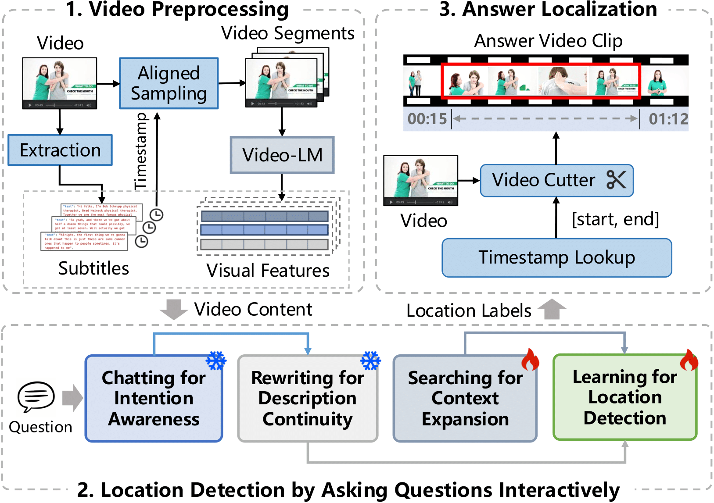

<div align="center">
  <h2>Ask2Loc: Learning to Locate Instructional Visual Answers<br>by Asking Questions</h2>
  <p>🧠 Instructional Visual Answer Localization | 🤖 Large and Pre-trained Language Models | 📊 Human Computer Interactions  </p>
</div>

## ✨ Overall Framework


## 💡 Interactive and Learning Modules


- Chatting for Intention Awareness

- Rewriting for Description Completeness

- Searching for Context Expansion

- Learning for Answer Location Detection

## 📕 Dataset
- For the video subtitles and visual features downloading, please download from our [GoogleDrive](https://anonymous.4open.science/r/Ask2Loc-480F) (update later)

- For the In-VAL datasets including questions, descriptions, context, and visual locations, please redirect to our [DatasetFolder](https://anonymous.4open.science/r/Ask2Loc-480F/dataset/)

## 🚀 Usage

### 🛠️ Train
1. Install Requirements

2. Setup Training Configuration
```vim config.py```


3. Run Training
```python train.py```

### 📜 Evaluation
```python evaluate.py```


## 📂 Checkpoints
Please download from our [GoogleDrive](https://anonymous.4open.science/r/Ask2Loc-480F) (update later)

## 🕹️ Demo
