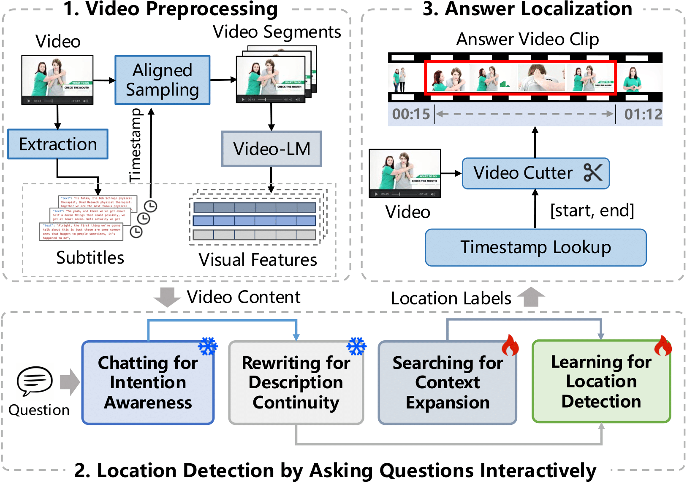
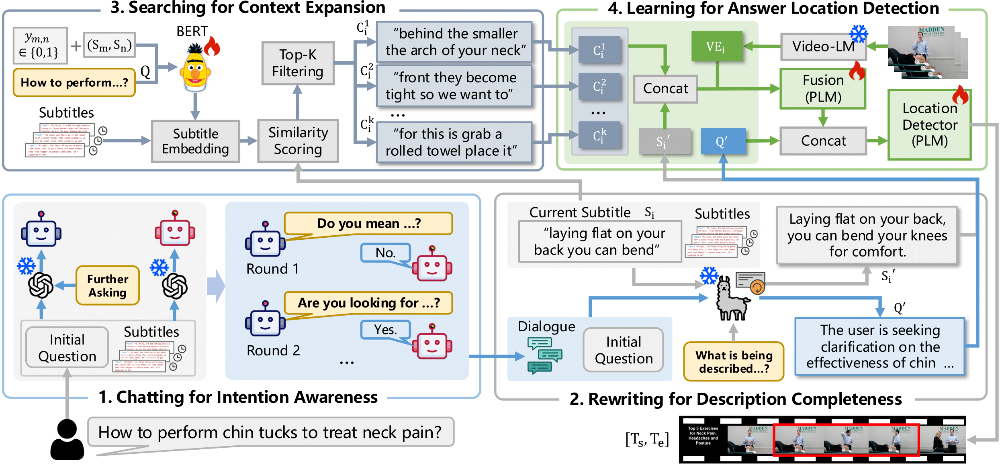

<div align="center">
  <h2>Ask2Loc: Learning to Locate Instructional Visual Answers<br>by Asking Questions</h2>
  <p>📹 Instructional Visual Answer Localization | 🤖 Large and Pre-trained Language Models </p>
  <p> 🙋 Human Computer Interactions  </p>
</div>

## ✨ Overall Framework


We propose **Ask2Loc**, an interactive visual answer localization framework that identifies precise video segments to answer a user question by acquiring auxiliary knowledge through simulating multiple interactions via asking formats. The top-level framework consists of three primary phases as shown in the above figure.

## 💡 Interactive and Learning Modules


- **Chatting for Intention Awareness:** Given that instructional videos often contain extensive domain knowledge that users are unfamiliar with, which leads to vague initial queries, this work leverages large language models (LLMs) to simulate interactive dialogue, progressively refining user intent through follow-up questioning and thus provide user-expected system responses.

- **Rewriting for Description Completeness:** The In-VAL process faces two forms of semantic incompleteness: incomplete subtitle expressions within video segments and a semantic gap between prior QA dialogue and actual intent. These issues can be effectively addressed through LLM-based rewriting that improves linguistic completeness and alignment between user input and video content.

- **Searching for Context Expansion:** To simulate human-like localization behavior, we propose a context expansion strategy that leverages a fine-tuned pre-trained language model (PLM) to identify semantically similar video segments to enhance the understanding and assessment of a given segment. This method is inspired from embedding-based retrieval in retrieval-augmented generation (RAG) systems.

- **Learning for Answer Location Detection:** We formulate the task of identifying whether each video segment falls within the answer span as a classification problem, where visual features are projected into the same space as textual features, fused with contextual encodings via a PLM, and jointly optimized through PLM-based fine-tuning using ground-truth and predicted location labels.

## 📕 Dataset
- We reconstruct three instructional visual answer localization datasets for our In-VAL task. These datasets are named as In-MedVidQA (medical in English), In-VehicleVQA (vehicle in English), and In-CMIVQA (medical in Chinese), across multiple domains and multilingual scenarios.

- For each sample (an individual video segment) in these datsets, the following data fields are included:
  - Input Question
  - Answer Span (start time and duration)
  - Within Answer Label (0 or 1)
  - Current Subtitle
  - Chatting Dialogue (R Rounds)
  - Rewritten Question (User Intent)
  - Rewritten Subtitle (Current Content)
  - Expanded Context (Top K Relevant Subtitles)

- For the video subtitles and visual features downloading, please download from our [GoogleDrive](https://anonymous.4open.science/r/Ask2Loc-480F) (update later)

- For the In-VAL datasets including questions, descriptions, context, and visual locations, please redirect to the folder [Dataset](https://anonymous.4open.science/r/Ask2Loc-480F/dataset/)

## 🚀 Usage

### 🛠️ Train
1. Install Requirements

2. Setup Training Configuration
```vim config.py```


3. Run Training
```python train.py```

### 📜 Evaluation
1. Run evaluation with ```python evaluate.py```

2. Important Results (mIoU):

| Framework      |      Method      |  In-MedVidQA  |  In-VehicleVQA  |  In-CMIVQA  |
| :---           |      :----:      |     :----:    |      :----:     |    :----:   |
| End-to-End     |   RandomGuess    |      5.96     |       4.96      |     4.21    |
|                |     LLM-Gen      |      9.42     |      10.17      |     8.57    |
|                |    Video-LLM     |      12.90    |      14.65      |     9.45    |
|                |    PLM-Fusion    |      29.36    |      38.26      |     22.70   |
|                |   PLM-Context    |      35.46    |      36.88      |     20.26   |
|                |    PLM-Prompt    |      37.08    |      40.37      |     27.52   |
| Two-Stage      |  Retrieval-Loc   |      28.52    |      33.72      |     16.59   |
|                |    Expand-Loc    |      29.47    |      32.14      |     15.81   |
|                |   Describe-Loc   |      31.02    |      26.75      |     20.76   |
| **Interactive**|**Ask2Loc (Ours)**|    **43.22**  |    **55.28**    |   **31.37** |

## 📂 Checkpoints
Please download from our [GoogleDrive](https://anonymous.4open.science/r/Ask2Loc-480F) (update later)

## 🕹️ Demo

